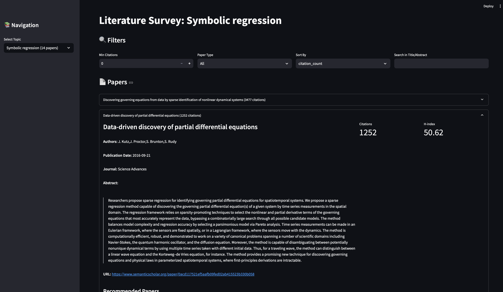
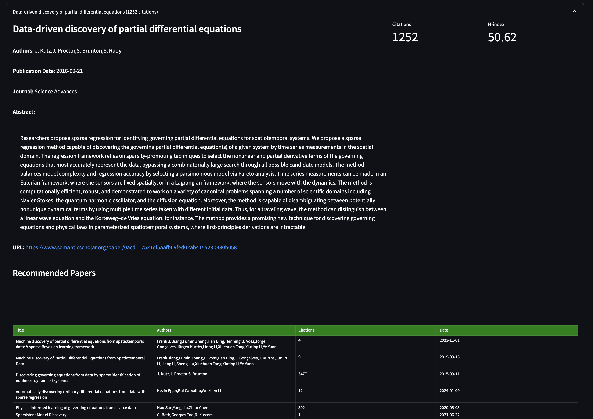
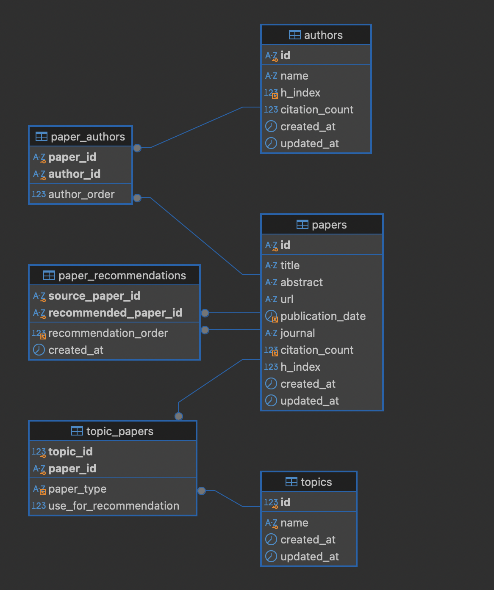
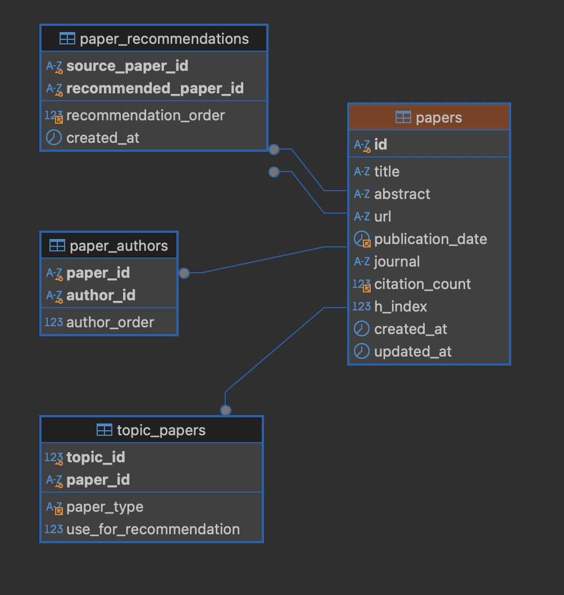
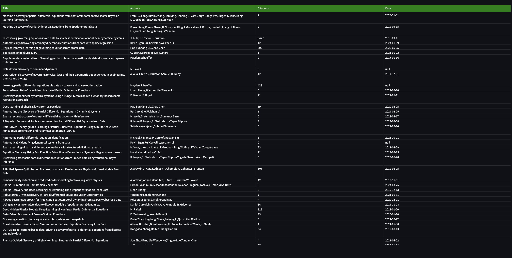

<h1 align="center" style="border-bottom: none;">🔍 Literature Survey Engine</h1>

An advanced academic literature analysis system that integrates with the Semantic Scholar API to fetch, process, analyze, and visualize research papers and their relationships. The system provides paper recommendations, calculates author metrics, and offers interactive visualizations through a Streamlit dashboard.



## 🌟 Key Features

- **Paper Analysis**: Fetch and analyze academic papers with their metadata
- **Author Metrics**: Calculate and track author h-indices and citation counts
- **Paper Recommendations**: Get intelligent paper recommendations based on topic similarity
- **Interactive Dashboard**: Visualize paper relationships and metrics through Streamlit
- **Robust Data Management**: MySQL-based storage with proper indexing and relationships
- **Docker Integration**: Containerized database setup for easy deployment

An enhanced version of the automated literature survey tool, building upon [VirtualPatientEngine's original project](https://github.com/VirtualPatientEngine/literatureSurvey). This version adds advanced features including interactive visualization, comprehensive author metrics, and enhanced paper recommendations.

## 🌟 New Features

All original features from VirtualPatientEngine's project:

- Automated literature surveys using Semantic Scholar's Recommendation API
- Zotero integration for reference management
- Weekly automatic updates
- Category-based and single-paper recommendations

Plus new advanced features:

- **Interactive Dashboard**: Visualize paper relationships and metrics through Streamlit
- **Enhanced Author Metrics**: Advanced h-index calculations and citation analysis
- **Comprehensive Database**: MySQL-based storage with proper indexing
- **Advanced Paper Processing**: Improved recommendation algorithms
- **Docker Integration**: Containerized setup for easy deployment



## 🏗️ System Architecture

### Component Overview

```
Literature Survey System
├── Data Collection Layer (Semantic Scholar API Integration)
├── Data Processing Layer (Paper & Author Analysis)
├── Storage Layer (MySQL Database)
└── Visualization Layer (Streamlit Dashboard)
```





### Core Components

- `Article` & `Author` classes: Advanced data modeling
- `DataFetcher`: Enhanced API interactions
- `DatabaseManager`: Robust MySQL operations
- `StreamlitDashboard`: Interactive visualizations
- `Topic`: Sophisticated paper organization

## 📋 Prerequisites

- Python 3.9+
- Docker and Docker Compose
- MySQL 8.0+
- Semantic Scholar API access
- Git
- Zotero account (optional)

## 🚀 Getting Started

### For Non-Developers

1. Click `Use this template` to create your repository
2. Prepare `query.csv` with your topics and papers
3. Upload to the `data` folder
4. Wait for automated deployment
5. Configure GitHub Pages for website access

### For Developers

1. **Clone the Repository**

   ```bash
   git clone https://github.com/ansh-info/literatureSurvey.git
   cd literatureSurvey
   ```

2. **Set Up Environment**

   ```bash
   python -m venv env
   source env/bin/activate  # On Windows: .\env\Scripts\activate
   pip install -r requirements.txt
   ```

3. **Configure Database**

   ```bash
   cp .env.example .env
   ./manage.sh start
   ```

4. **Run the Application**

   ```bash
   cd code
   python literature_fetch_recommendation_api.py

   # Run the Application
   streamlit run app/app.py
   ```

5. **Initialize Database**
   - The schema will be automatically initialized using `01_schema.sql`
   - Verify database creation:
     ```bash
     docker exec -it scholar_db mysql -u scholar_user -p scholar_db
     ```

## 📊 Features in Detail

### Paper Processing Pipeline

1. CSV input processing (paper URLs and topics)
2. Semantic Scholar API data fetching
3. Author metrics calculation
4. Paper relationships analysis
5. Recommendation generation
6. Data storage and indexing
7. Visualization generation



### Metric Calculations

- **H-index**: Weighted average of author h-indices
- **Citation Impact**: Analysis of paper citation counts
- **Topic Relevance**: Based on paper relationships
- **Author Influence**: Combination of citations and h-index

### Data Visualization

- Paper relationship networks
- Citation trends over time
- Author collaboration networks
- Topic-based paper clustering
- Interactive metric dashboards

### API Configuration

Configure Semantic Scholar API settings in `utils.py`:

```python
FIELDS = "paperId,url,authors,journal,title,..."
```

## 🛡️ Error Handling

The system implements robust error handling:

- API rate limiting management
- Database connection retry logic
- Data integrity checks
- Transaction management
- Comprehensive error logging

## 📝 Usage

1. **Data Input**

   - Prepare CSV file with paper URLs and topics
   - Configure processing parameters
   - Run data collection script

2. **Analysis**

   - Access dashboard at `http://localhost:8501`
   - Select topics to analyze
   - View paper relationships and metrics
   - Export analysis results

3. **Maintenance**

   ```bash
   # Update paper metrics
   python update_h_indices.py

   # Manage database
   ```

## 🚧 Future Improvements

- [ ] Advanced caching mechanism
- [ ] Enhanced recommendation algorithms
- [ ] Citation network visualization
- [ ] Batch processing optimization
- [ ] Extended API integration
- [ ] Advanced search functionality
- [ ] Export capabilities
- [ ] Dark/light theme toggle
- [ ] AI-based recommendations for individual papers
- [ ] Recommendations based on paper categories and relationships

## 💾 Database Schema

```sql
Tables:
- topics (id, name)
- papers (id, title, abstract, url, h_index, etc.)
- authors (id, name, h_index, citation_count)
- paper_authors (paper_id, author_id, order)
- topic_papers (topic_id, paper_id, type, use_for_recommendation)
- paper_recommendations (source_id, recommended_id, order)
```

## 🔧 Configuration

### Environment Variables

```env
MYSQL_DATABASE=scholar_db
MYSQL_USER=scholar_user
MYSQL_PASSWORD=scholar_pass
MYSQL_ROOT_PASSWORD=rootpass
MYSQL_PORT=3306
ZOTERO_API_KEY=your_api_key
LIBRARY_ID=your_library_id
TEST_COLLECTION_KEY=your_collection_key
```

## 📊 Features in Detail

- Interactive paper relationship networks
- Citation trend analysis
- Author collaboration visualization
- Topic-based clustering
- Advanced metric calculations
- Automated weekly updates

## 🤝 Contributing

1. Fork the repository
2. Create feature branch (`git checkout -b feature/AmazingFeature`)
3. Commit changes (`git commit -m 'Add AmazingFeature'`)
4. Push to branch (`git push origin feature/AmazingFeature`)
5. Open Pull Request

## 🐞 Bugs and Feature Requests

Please report bugs and request features via [GitHub Issues](https://github.com/ansh-info/literatureSurvey/issues).

## 📄 License

This project is licensed under the MIT License - see the [LICENSE](LICENSE) file for details.

## 🙏 Acknowledgments

- [VirtualPatientEngine](https://github.com/VirtualPatientEngine/literatureSurvey) for the original literature survey tool
- [Semantic Scholar API](https://www.semanticscholar.org/product/api)
- [Streamlit](https://streamlit.io/)
- [MySQL](https://www.mysql.com/)
- [Zotero](https://www.zotero.org/)
- [MkDocs](https://www.mkdocs.org/)
